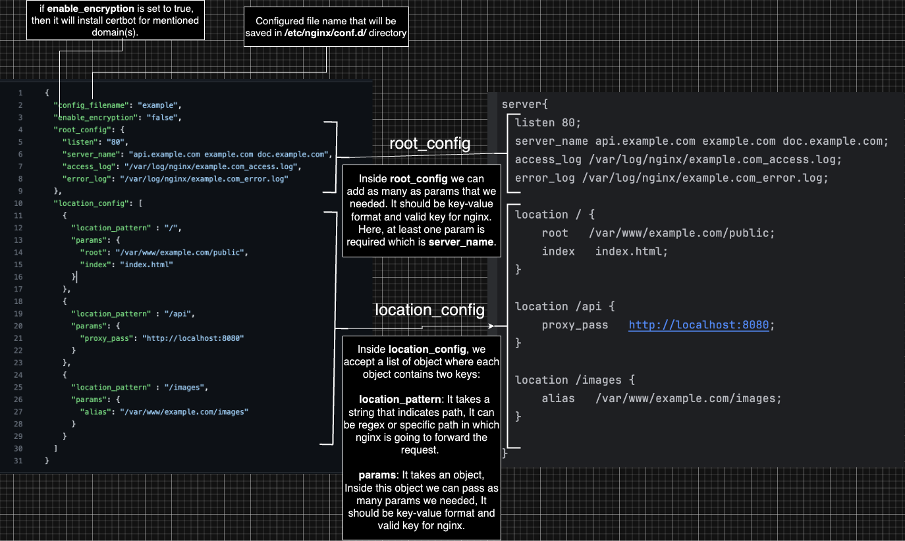
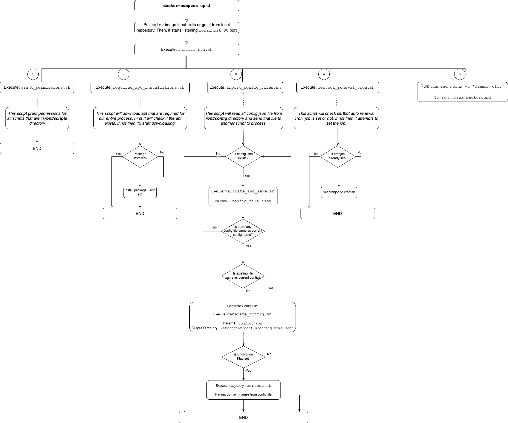

### Json To Config File Map and Docker Compose Execution Flow

#### ★ How to start?
1. run `./start_nginx.sh`  : To start nginx service using docker
2. run `./restart_nginx.sh` : To restart docker container(If necessary)
3. run `./refresh.sh`  : Run after adding/removing/updating any config file inside `/configs` directory.

#### ★ Note: 
<b>1.1</b> Before running these scripts, we have to make sure these file has execution permission or not. We can set execution permission by running command `chmod +x <file_name>.sh`

<b>1.2</b> While configuring json file, if we want  to forward any request to  any `localhost with port`, then instead of `localhost`, we have to use `dockerhost` instead. It'll communicate with host machines localhost with specified port. 
And for static page serve, we have to keep the folder(that contains the static pages) inside `static-sites` directory.

#### ★ Json To Config File Map

#### ★ Docker Compose Execution Flow

